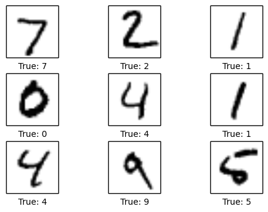
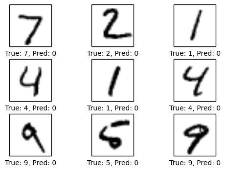
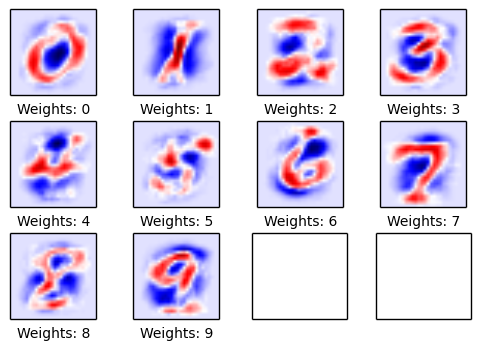
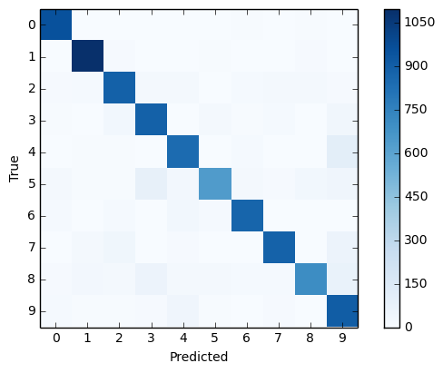

# **Tensodrflow Tutorial (Mnist dataset)**

The MNIST database of handwritten digits, available from this page, has a training set of 60,000 examples, and a test set of 10,000 examples. It is a subset of a larger set available from NIST. The digits have been size-normalized and centered in a fixed-size image.
It is a good database for people who want to try learning techniques and pattern recognition methods on real-world data while spending minimal efforts on preprocessing and formatting.
You can download the dataset from [here](http://yann.lecun.com/exdb/mnist/)
You can use the test.ipyb file to do testing, a cleaner code is available in the mnist.ipyb file.

## **Results**

1. Correctly classified examples.

1. Incorrectly classified examples.

1. This shows the weights of the neural netowrk for each class. As you can see the neural network learns a representation for each digit.

1. Confusion matrix, Shows the classifcation for data points.

